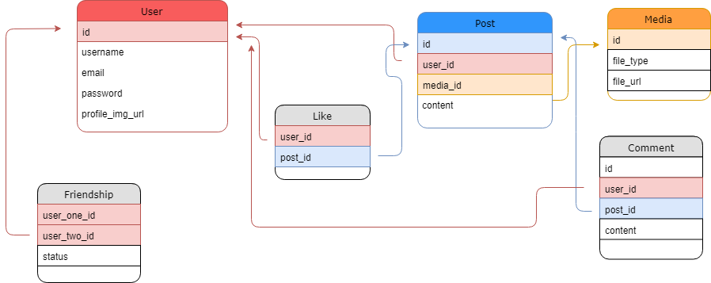

# Instagram Clone Api <small>(GraphQL, Heroku Postgres, and Express)</small>

<br>

## Database Design

<br>



<br>
<br>

## GraphQL Types

<br>

```typescript 

type User {
    id: ID
    username: String
    email: String
    profile_img_url: String
    token: String
}

type Post {
    id: ID
    author: User
    media: Media
    content: String
    likes: [Like]
    comments: [Comment]
}

type Media {
    fileType:   String
    file_url:   String
}

type Like {
    user: User
    post: Post
}

type Comment {
    author: User
    post: Post
    content: String
}

// type Friendship {
    . . .
// }

```

Project dates: 5/7/2018 - Current

Currently working on building database in postgres. 